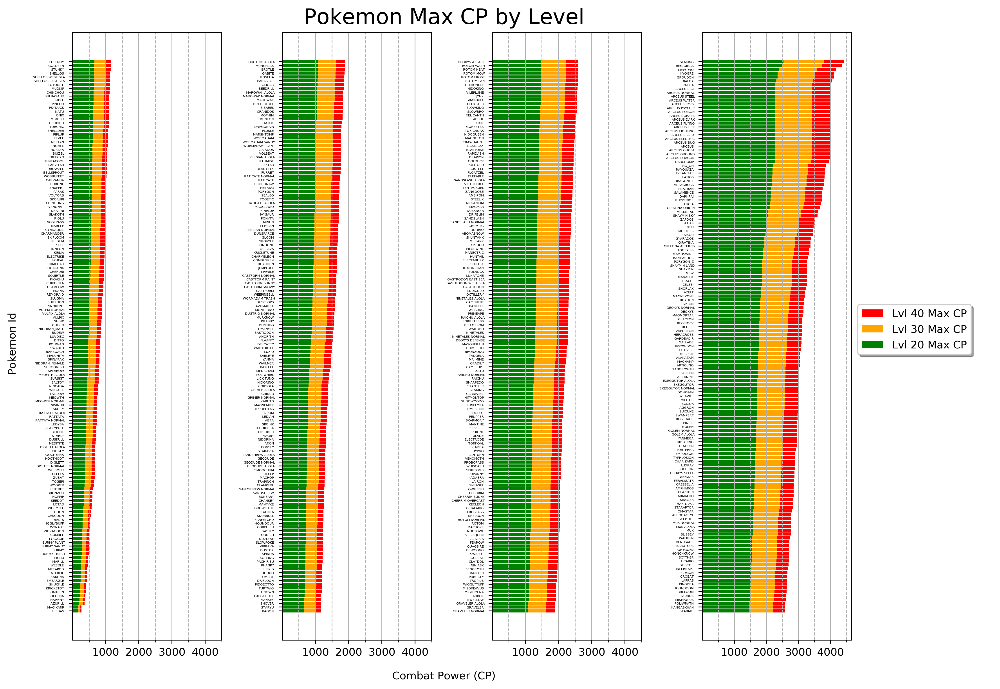

# Plotting Pokemon Max Combat Power 
This notebook contains nine different iterations of plots in an attempt to visualize a Pokemon's max Combat Power (CP) in [Pokemon GO](https://www.pokemongo.com/en-us/). CP represents a Pokemon's ability to perform well in battle, a higher CP generally means a Pokemon will be a better fighter. CP is calculated from a Pokemon's base stats: Attack, Defence, and Stamina (somtimes called HP). As a Pokemon levels up, it's base stats increase and as a result Combat Power also increases.

Example output:

## Table of Contents
* Equations - Calculating CP
* Mining Data
* Attempt 1 - Scatter Plot (Level vs CP)
* Attempt 2 - Scatter Plot (Pokemon vs CP)
* Attempt 3 - Layered Bar Chart
* Attempt 4 - Four Bar Chart Subplots (sliced by generation, sorted by number)
* Attempt 5 - Horizontal Bar Chart (sorted by number)
* Attempt 6 - Horizontal Bar Chart (sorted by CP)
* Attempt 7 - Horizonatal Bar Chart (Colorized)
    * What color is Bulbasaur? - Getting to know OpenCV color spaces
    * Finding dominant colors in pokemon sprites (k-means and frequency count)
    * Plotting Attempt 7 - Horizonatal Bar Chart (Colorized)
* Attempt 8 - Four Bar Chart Subplots (sorted by CP)
* Attempt 9 - Four Horizontal Bar Chart Subplots (sorted by CP)

This project covered a huge variaty of programming and Python related topics that I had never been exposed to. I learned a lot of new information about the following (in no particular order):
- [matplotlib](https://matplotlib.org/)
- [numpy](https://www.numpy.org/)
- [pandas](https://pandas.pydata.org/)
- [Jupyter Notebooks](https://jupyter.org/)
- [Open CV](https://opencv.org/about/)
- [color spaces](https://en.wikipedia.org/wiki/Color_space)
- [json](https://en.wikipedia.org/wiki/JSON)
- [data mining](https://en.wikipedia.org/wiki/Data_mining)
- [Google Protocol Buffers](https://developers.google.com/protocol-buffers/)
- [k-means clustering algorithm](https://en.wikipedia.org/wiki/K-means_clustering)
